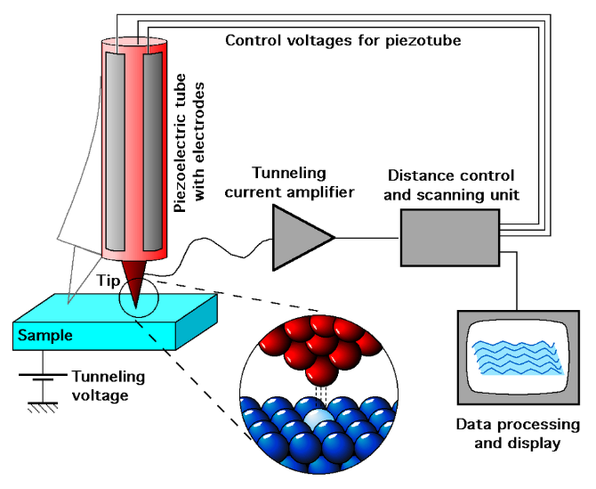
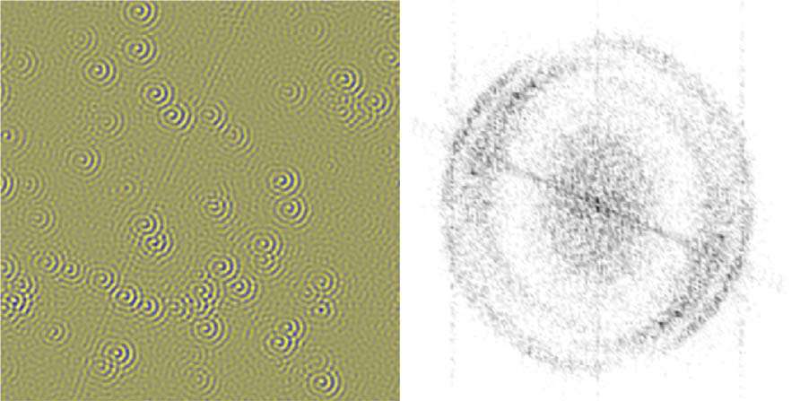

# Isoenergy

扫描隧道显微镜散射解金属等能面。

提示：如果你无法渲染其中的公式，请阅读 `README.pdf`，两者内容相同。

## 大作业简介

探索晶体材料的新奇电子结构是凝聚态物理学的重要课题之一。扫描隧道显微学（Scanning tunneling microscopy, STM）与隧道谱学（Scanning tunneling spectroscopy, STS）能够直接测量材料表面原子晶格结构与能态密度（Density of states, DOS）。该测量方法对于探究材料表面态（Surface state）或石墨烯等层状材料的准二维电子结构则更加具有优势。

  
*扫描隧道显微镜结构 (from Wikipedia)*

通常认为扫描隧道显微镜（Scanning tunneling microscope, STM）探测到的都是实空间（Real-space）的信号，要想得到倒空间（k-space）的信息还得依赖于其它具有动量分辨能力的测量手段。

例如，角分辨光电子谱（Angle-resolved Photoemission Spectroscopy , ARPES）是一种能直接获得电子动量与能量的测量方法。人们为了同时获得时空间与动量空间的信息，发展出了傅里叶变换隧道谱学（Fourier Transform STS, FT-STS）的方法，能够从STM 测到的实空间图像中获得动量空间的信息，进而得到能带结构等重要信息。那么 FT-STS 的基本原理是怎样的呢？我们通过 STM 测量样品在某个能量上各处的局域能态密度（Local DOS）。当样品上有杂质时（真实材料中往往如此），该处的波函数将被散射。由于该散射过程通常是相干的，入射波与反射波将相干叠加形成驻波，对局域能态密度形成调制，所形成的波纹状图案通常被称为准粒子干涉（Quasiparticle Interference, QPI）图样。

总之，动量空间中的信息通过散射过程投射到了实空间的数据中。通过对时空间图像进行傅里叶变换，我们将能得到驻波的波矢信息，进而推断出等能面（Isoenergic Surface）的结构。

  
*铜表面二维电子气的 QPI 图样及其 FFT [Nat. Commun. 6, 8691 (2015)]*

利用对 QPI 分析，人们研究了石墨烯（Graphene）[Science 317, 219–222 (2007)]，铜氧化物高温超导体（High-Tc Cuprate Superconductors）[Science 297, 1148–1151 (2002)]、铁基超导体（Fe-based Superconductors）[Nat. Commun. 7, 10565 (2016)]等新奇材料的电子结构，极大促进了人类对物质世界的认识与理解。

本大作业旨在同学们掌握通过局域态密度图（Local DOS Map）得到二维等能面结构（Isoenergic Surface）的基本原理与相关数据处理方法。分为两个步骤进行，这是是大作业的第一步，利用假设的动量空间等能面结构，生成中心散射点（两种不同类型的杂质）附近区域的局域态密度图，即 QPI 图样。

## 数据说明

100份不同的等能面附近的态密度分布，存在 `dos-momentum` 中。每份数据是一个 `HDF5` 文件，文件中 `/isoE` 是一个 `(201, 201)` 的二维数组，数字代表电子在倒空间中的态密度。其中倒空间的单位为任意值，态密度的归一常数也是任意值：在本问题中，只有相对强度有明确的物理意义。

### 输出路径

`dos-position` 代表普通散射中心的实空间，`dos-position/m` 代表磁性散射中心的实空间，`dos-position/damp` 代表衰减的普通散射中心的实空间，`dos-position/m/damp` 代表衰减的磁性散射中心的实空间。

将以上的路径中 `dos-position` 替换成 `STM`，则对应相应输出数据的可视化图。

输入数据的可视化图在 `p_momentum` 目录中。

## 作业要求（功能部分）

### Makefile

本次作业提供了 Makefile，最终助教也将使用 Makefile 进行测试。需要注意，你在编写所有程序文件时，都应该使用 make 给程序传入的参数（来自 `sys.argv`），而非硬编码下面提到的任何文件名或文件编号等信息；否则，你可能无法通过测试。

在本目录中运行 `make -n` 即可看到实际运行的命令，这或许能帮助你开发。

### 基本要求

作业功能部分（占80分）的基础要求分成以下几个部分，完成各个任务即可拿到相应分数。

| 任务（程序名）  | 分数 |
| --------------- | ---- |
| scatter.py      | 40   |
| gimage.py       | 20   |
| damping.py      | 20   |

#### `scatter.py `

读取 `dos-momentum/%.h5`，输出 `dos-position/%.h5`，其中`%`代表从 `0000` 到 `0099` 的字符串。以 `dos-momentum/0023.h5` 程序的调用形式为：

```bash
python3 scatter.py 0 dos-momentum/0023.h5 dos-position/0023.h5
```

其中第一个参数 `0` 代表普通散射中心模式，即入射波和出射波在散射中心没有相位差。如果第一个参数是 `1`，代表磁性散射中心模式，即入射波和出射波在散射中心有 $\pi$ 的相位差。

设倒空间的态密度为 $f(\mathbf{k})$, 当散射中心在实空间原点时，实空间的态密度为：

$$
 D(\mathbf{r}) = \int \mathrm{d}\mathbf{k}_1 f(\mathbf{k}_1) \left|\int \mathrm{d}\mathbf{k}_2 f(\mathbf{k}_2) (e^{-i\mathbf{k}_1\mathbf{r}} + e^{-i\mathbf{k}_2\mathbf{r}})\right|^2
$$

如果散射中心有磁性，即 `sys.argv[1]==1` 时，需要给出射波填加一个 $\pi$ 的相位：

$$
D(\mathbf{r}) = \int \mathrm{d}\mathbf{k}_1 f(\mathbf{k}_1) \left|\int \mathrm{d}\mathbf{k}_2 f(\mathbf{k}_2) (e^{-i\mathbf{k}_1\mathbf{r}} + e^{-i(\mathbf{k}_2\mathbf{r} + \pi)})\right|^2 
$$

#### `gimage.py`

读取实空间（当 `sys.argv[1]==1`）或倒空间（当`sys.argv[1]==0`）的二维态密度数组，画出可以表征二维标量场的图形。以 `dos-momentum/0023.h5` 为例，程序的调用形式为：

```bash
python3 gimage.py 0 dos-momentum/0023.h5 p_momentum/0023.png
```

注意标注横纵坐标的标签、图的标题。

提示：备选之一为 `matplotlib.pyplot.imshow`。

#### `damping.py`

对理想条件下的散射态密度依距离衰减：

$$
 D^*(\mathbf{r}) = D(\mathbf{r}) e^{-|\mathbf{r}| / L} 
$$

其中 $L=20$ 为衰减长度，定为 20 个实空间像素单位。程序的调用形式为：

```bash
python3 damping.py dos-position/0023.h5 dos-position/damp/0023.h5
```

#### `dos-position/%.h5`

`dos-position` 各级目录下的 `.h5` 文件中，都使用名为 `/QPI` 的 `(201,201)` 二维数组来存储实空间的 QPI 图样。

### 提高要求

提高要求为加分项，至多可加 20 分。你可以自由发挥，可选项为：

* 生成散射点不在图像中心的 QPI 图样。这能为后续作业提供更为丰富的数据集。
* 生成存在多个散射点的 QPI 图样。在真实材料体系中，杂质点的分布通常是随机且相对密集的，即在所测到的局域态密度图内包含数十个散射中心。生成 QPI 图样时注意要保证入射波与出射波在每一个散射点满足相位要求。
* 为不同散射过程指定不同散射概率。即对于一组 $(\mathbf{k}_1,\mathbf{k}_2)​$，其发生概率P依赖于 $\mathbf{k}_1​$ 和 $\mathbf{k}_2​$。而在基本要求中，我们认为不同散射过程是等概率的。可以采用的形式如：

$$
P(\mathbf{k}_1,\mathbf{k}_2 )=\frac{1}{2}\left( 1-\frac{\mathbf{k}_1 \cdot \mathbf{k}_2}{\left| \mathbf{k}_1 \right| \left| \mathbf{k}_2 \right|} \right)
$$


​	或者用矩阵形式进行任意指定。

如果你实现了任何提高要求，请在实验报告中详细说明你的工作，这将作为评分的依据。

## 作业要求（非功能部分）

非功能部分的要求详见大作业公告，此部分占 20 分。
